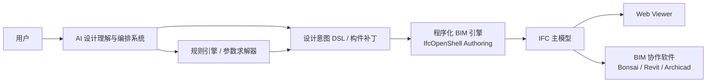
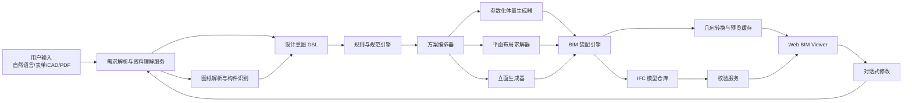
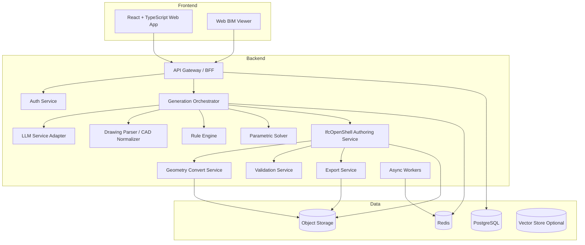
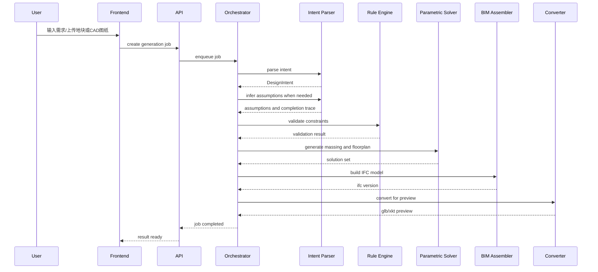

# 建筑自动建模系统设计文档

版本：`v0.1`

日期：`2026-03-30`

适用范围：`BIM + 参数化 + AI` 混合架构的建筑方案自动建模软件

## 1. 文档目标

本文档用于定义一套面向建筑设计场景的自动三维建模系统，目标是让用户通过自然语言、结构化条件和参考资料，自动生成可编辑、可校验、可导出的建筑 `BIM` 模型，并支持后续迭代修改。

本文档重点覆盖：

- 产品边界与目标
- 总体技术架构
- 关键模块设计
- 核心数据结构
- 生成与修改流程
- 接口设计
- 非功能性要求
- 实施计划与主要风险

## 2. 背景与定位

传统 `3D` 建模更关注几何结果，而建筑场景需要同时满足以下要求：

- 模型具有建筑语义，而不是纯网格
- 模型可编辑、可校验、可导出为 `IFC`
- 方案生成要遵守场地与规范约束
- 支持方案迭代、版本对比、面积统计和构件级修改

因此，本系统不采用纯 `text-to-3D` 路线，而采用三层混合架构：

- `AI`：负责需求理解、方案编排、交互修改和候选方案生成
- `参数化建模`：负责体量、平面、立面和构件的可控生成
- `BIM`：负责语义建模、数据交换、校验和交付

## 3. 产品目标

### 3.1 核心目标

用户输入建筑需求后，系统自动完成：

- 从 `CAD/DWG/DXF/PDF` 图纸重建建筑语义模型
- 建筑需求解析
- 场地和规则约束检查
- 体量方案生成
- 标准层和典型功能平面生成
- 墙、板、柱、门窗、楼梯、电梯核等构件装配
- `BIM` 模型构建
- 在线预览、指标查看、对话式修改
- 支持按构件条件进行局部批量替换，例如批量替换指定尺寸窗型
- 导出 `IFC / GLB / OBJ / PDF` 草图成果

### 3.2 首期聚焦场景

第一阶段建议聚焦以下建筑类型之一：

- 住宅楼
- 中小型办公楼
- 园区配套建筑

本设计文档以“`住宅 / 办公` 方案自动生成”作为默认场景。

### 3.3 支持的输入模式

系统支持两类核心建模模式：

- `图纸驱动建模`：用户上传 `CAD/DWG/DXF/PDF` 平面图、立面图、剖面图等资料，系统先进行图纸解析、语义识别和 `BIM` 重建，再接受进一步的构件级修改指令。
- `文本驱动建模`：用户直接描述希望建立的建筑模型，由 `AI` 自动补充缺失但非关键的参数，并明确标注补全来源和默认假设。

对于文本驱动模式，系统遵循以下补全优先级：

1. 用户明确输入的约束
2. 用户上传资料中可解析出的信息
3. 建筑类型模板默认值
4. 地区规则集与企业标准参数
5. `AI` 推断出的假设值

其中，影响法规合规和交付结果的关键字段若缺失，可先生成“草案方案”，但必须在导出正式 `IFC` 前标记为待确认项。

### 3.4 非目标

首期不覆盖以下内容：

- 施工图深度自动出图
- 复杂自由曲面地标建筑
- 结构受力分析结果直接闭环
- 机电 `MEP` 深度协同设计
- 全地区法规自动完备覆盖

## 4. 用户角色与典型场景

### 4.1 用户角色

- `方案建筑师`：快速生成体量和平面候选方案
- `BIM 工程师`：检查模型语义、修正构件和导出 `IFC`
- `项目经理`：查看指标、版本对比、导出汇报材料

### 4.2 典型使用流程

#### 场景 A：图纸驱动建模与构件替换

1. 用户创建项目，上传 `CAD/DWG/DXF/PDF` 图纸、地块边界和设计条件。
2. 系统识别图层、轴网、墙线、门窗块、标注和楼层关系，重建初始 `BIM` 模型。
3. 用户查看自动建模结果，并提出局部修改要求，例如“将模型内 800×1200 的窗全部更换为落地窗”。
4. 系统将指令解析为构件筛选条件和替换动作，定位符合条件的全部窗构件。
5. 系统执行批量替换，并尽量保留宿主墙体、洞口基准、标高和材质继承关系。
6. 系统重新校验受影响区域并生成新版本。

#### 场景 B：文本驱动建模与 AI 自动补全

1. 用户创建项目，输入需求，例如“在 8000 平方米地块上生成一栋 12 层住宅楼，两梯四户，现代风格，容积率 2.5”。
2. 系统将自然语言解析为结构化设计意图，并识别缺失条件。
3. 对缺失但非关键的部分，系统基于建筑类型模板、规则集和历史经验自动补全，并标记假设来源。
4. 规则引擎检查硬约束，识别需要用户确认的关键项。
5. 方案生成器输出 3 至 5 个候选体量方案。
6. 用户选中方案后，系统生成标准层、交通核、户型、立面和主要构件。
7. 用户继续用对话方式修改，例如“南侧加阳台，窗墙比降低 10%”。
8. 系统仅对受影响区域局部重生成，并保留版本历史。
9. 用户导出 `IFC`、`GLB`、指标表和方案截图。

## 5. 总体架构

## 5.1 架构原则

- 语义优先：系统内部主模型为 `BIM` 语义对象，不以纯网格为主存储
- 规则优先：硬约束由规则引擎控制，避免 `AI` 自由生成不合规方案
- 可编辑优先：几何由参数驱动，支持局部重生成
- 异步优先：方案生成、几何装配、导出、校验走任务流水线
- 版本优先：每次生成和修改都保留设计快照

### 5.2 AI 系统与 BIM 引擎关系

本项目的核心不是“让 `AI` 直接操作某个 `BIM` 软件界面”，而是构建一个由 `AI` 驱动的建筑建模系统。

推荐的职责边界如下：

- `AI 系统`：理解用户需求、补全缺失字段、生成结构化命令、决定调用哪些建模模块
- `规则与求解系统`：负责可行性判断、规范约束、参数求解和局部重生成范围判定
- `BIM 引擎`：负责真正创建和修改 `IfcWall`、`IfcWindow`、`IfcSlab`、`IfcSpace` 等语义对象
- `BIM 软件`：作为人工校正、可视化检查或外部协作工具，不应作为核心自动建模执行器

系统原则：

- `AI` 不直接模拟鼠标和菜单操作
- `AI` 输出结构化意图和补丁，而不是界面动作脚本
- 核心建模通过 `IfcOpenShell` 等程序化 `BIM` 引擎完成
- `Revit / Bonsai / Archicad` 等软件主要作为协作端和审阅端

关系图如下：



该结构的关键收益：

- 更适合服务端自动化运行
- 更容易做批量构件替换和局部重生成
- 不依赖单一商业软件界面
- 更容易做版本控制、审计和回放

### 5.3 逻辑架构图



### 5.4 部署架构



## 6. 技术选型

### 6.1 推荐技术栈

前端：

- `React + TypeScript`
- `Vite`
- `Tailwind CSS` 或企业内部设计系统
- `xeokit` 或 `Three.js` 作为三维预览层

后端：

- `Python 3.12`
- `FastAPI`
- `Pydantic`
- `Celery` 或 `RQ`
- `Redis`

数据层：

- `PostgreSQL`
- `MinIO / S3`
- 可选 `pgvector` 用于参考案例检索

几何与 BIM：

- `IfcOpenShell`
- `Open CASCADE`
- 可选 `Blender` 用于渲染截图、格式转换和视觉补充处理

求解与规则：

- `Google OR-Tools`
- 自定义规则引擎

### 6.2 选型说明

- `IfcOpenShell` 用于创建、编辑、查询和导出 `IFC` 模型，是系统的核心 `BIM` 作者工具。
- `Open CASCADE` 用于更底层的精确几何计算、布尔运算、曲面与实体构造。
- `OR-Tools` 用于平面布局、功能邻接、走廊长度、面积约束等离散求解问题。
- `xeokit` 适合大型 `BIM/AEC` 模型浏览，但其官方文档明确提示开源版使用 `AGPLv3`，闭源商业产品需评估购买商业授权。
- 若对授权更敏感，可在前期使用 `Three.js` 自建查看器，后续再评估切换更专业的 `BIM Viewer`。

补充说明：

- `IfcOpenShell` 是本项目推荐的核心程序化 `BIM` 引擎。
- `Bonsai` 更适合作为人工审阅和调试端，而不是自动化编排核心。
- `Revit` 等商业 `BIM` 软件适合作为外部协作对象，通过 `IFC` 交换数据，而不建议作为自动建模主执行器。

## 7. 领域模型设计

### 7.1 核心对象层级

```text
Project
└── Site
    └── Building
        ├── Storey
        │   ├── Space
        │   └── Element
        │       ├── Wall
        │       ├── Slab
        │       ├── Column
        │       ├── Beam
        │       ├── Door
        │       ├── Window
        │       ├── Stair
        │       ├── Roof
        │       └── CurtainWall
        ├── Core
        ├── FacadeSystem
        └── Metrics
```

### 7.2 设计意图 DSL

系统内部不直接让各模块消费自然语言，而是先落地为统一的 `Design Intent DSL`。

示例：

```json
{
  "project_id": "proj_001",
  "source_mode": "text_only",
  "source_assets": [],
  "building_type": "residential",
  "site": {
    "boundary_source": "uploaded_polygon",
    "area_sqm": 8000,
    "setback": {
      "north": 10,
      "south": 15,
      "east": 8,
      "west": 8
    },
    "north_angle": 12
  },
  "constraints": {
    "floors": 12,
    "floor_height_m": 3.0,
    "height_limit_m": 40,
    "far": 2.5,
    "building_density": 0.22,
    "fire_ruleset": "cn_residential_v1"
  },
  "program": {
    "units_per_floor": 4,
    "core_type": "double_elevator",
    "unit_mix": [
      {"name": "A", "area_sqm": 95, "ratio": 0.5},
      {"name": "B", "area_sqm": 120, "ratio": 0.5}
    ]
  },
  "style": {
    "facade": "modern",
    "material": ["glass", "stone", "aluminum"],
    "balcony": true
  },
  "completion_policy": {
    "auto_complete_missing": true,
    "draft_allowed_for_missing_critical_fields": true
  },
  "assumptions": [
    {
      "field": "constraints/floor_height_m",
      "value": 3.0,
      "source": "residential_template_default"
    }
  ],
  "deliverables": ["ifc", "glb", "metrics_report"]
}
```

### 7.3 构件选择器与修改补丁

为了支持“按条件批量替换构件”，系统需要提供统一的构件筛选与补丁机制。

示例：将模型中所有 `800 x 1200 mm` 的窗替换为落地窗。

```json
{
  "selector": {
    "ifc_type": "IfcWindow",
    "properties": {
      "overall_width_mm": 800,
      "overall_height_mm": 1200
    }
  },
  "action": {
    "type": "replace_family",
    "target_family": "floor_to_ceiling_window",
    "preserve": ["storey", "host_wall", "axis_alignment", "material_style"]
  },
  "scope": {
    "building_id": "bld_001"
  }
}
```

该机制既可用于图纸驱动重建后的模型，也可用于文本驱动生成后的模型。

### 7.4 版本实体

每次生成都应形成一个不可变快照：

- `ProjectVersion`
- `IntentVersion`
- `BimModelVersion`
- `PreviewVersion`
- `MetricsVersion`

这样可以支持：

- 回滚
- 多方案对比
- 变更审计
- 局部重生成后合并

## 8. 模块详细设计

### 8.1 需求解析与资料理解服务

职责：

- 解析自然语言
- 从上传图纸或表单中抽取参数
- 解析 `CAD/DWG/DXF/PDF` 图纸并抽取图层、图元、标注、块定义和空间关系
- 将图纸信息与用户指令合并为统一的设计意图
- 识别缺失条件和歧义项
- 在文本驱动模式下自动补全缺失但非关键的字段
- 输出结构化 `DSL`

输入：

- 文本需求
- 表单字段
- 参考图
- `CAD/DWG/DXF/PDF` 图纸
- 地块边界

输出：

- `DesignIntent`
- `ParsedDrawingModel`
- `MissingFields`
- `Assumptions`
- `CompletionTrace`

实现方式：

- 大模型负责语言理解和字段归一
- `CAD` 标准化子模块负责将 `DWG/DXF` 转换为统一内部表达
- 图纸识别子模块负责识别轴网、墙线、门窗、房间边界、标高与尺寸标注
- `Pydantic/JSON Schema` 负责结构校验
- 缺失字段进入补全流程

提示词要求：

- 只输出结构化结果
- 明确区分用户明确提出的约束与系统默认值
- 明确标识 `AI` 自动补全字段、补全依据与置信度
- 给出不确定字段置信度

#### 8.1.1 图纸驱动模式处理流程

图纸驱动建模建议采用以下处理链路：

1. 文件标准化：将 `DWG/DXF/PDF` 转换为统一解析格式。
2. 图层映射：识别墙体、门窗、轴网、标注、文字说明所在图层。
3. 图元抽取：提取线、多段线、块参照、标注和文字。
4. 拓扑重建：根据墙线闭合关系重建空间边界与洞口位置。
5. 多视图配准：将平面、立面、剖面按轴网和标高统一。
6. 语义映射：将图元映射为 `IfcWall`、`IfcWindow`、`IfcDoor`、`IfcSpace` 等对象。
7. 约束补全：若图纸缺少某些构件参数，则结合用户指令与规则进行补全。

#### 8.1.2 文本驱动模式自动补全策略

文本驱动模式下，`AI` 负责补全如下信息：

- 缺失的常见层高
- 默认窗墙比范围
- 常见交通核尺寸
- 典型户型或办公功能配比
- 常见门窗族和立面模板参数

补全原则：

- 明示约束永远高于推断结果
- 法规相关字段需要标记为“待确认”
- 所有自动补全字段必须写入 `Assumptions`，用于后续审计和回滚

### 8.2 规则与规范引擎

职责：

- 管理硬约束
- 判断方案是否可行
- 为求解器提供边界条件

规则分类：

- 场地规则：红线、退线、限高、朝向
- 指标规则：容积率、建筑密度、绿地率
- 类型规则：住宅、办公、商业的典型模式
- 通用建筑规则：走廊宽度、核心筒尺寸、楼梯参数
- 地区插件规则：不同城市或国家的差异化规则集

实现建议：

- 规则配置以 `YAML/JSON` 管理
- 复杂规则使用 `Python` 插件
- 规则返回统一结果：

```json
{
  "status": "fail",
  "rule_code": "SETBACK_MIN_SOUTH",
  "severity": "error",
  "message": "南侧退界不足",
  "suggested_fix": "将主体向北移动 2 米"
}
```

### 8.3 方案编排器

职责：

- 决定生成流程和子模块调用顺序
- 控制失败重试和降级策略
- 输出候选方案集

编排逻辑：

1. 解析设计意图
2. 执行硬约束预检查
3. 生成体量候选
4. 对每个候选执行平面求解
5. 对通过求解的方案生成立面和构件
6. 计算指标并打分
7. 返回前 `N` 个方案

评分维度：

- 指标满足度
- 动线合理性
- 采光通风代理分
- 构件复杂度
- 用户偏好匹配度

### 8.4 参数化体量生成器

职责：

- 基于地块和指标生成建筑体量
- 输出楼栋轮廓、层数和占地关系

输入：

- 地块边界
- 退界
- 层数
- 目标总建面
- 朝向偏好

输出：

- `MassingOption[]`

算法建议：

- 规则模板法作为首选
- 对矩形或近矩形地块采用快速启发式生成
- 对复杂地块引入多目标搜索

常见体量模板：

- 板楼
- 塔楼
- 围合式
- 点式办公楼
- 双塔

输出内容：

- 建筑基底轮廓
- 层级关系
- 建筑朝向
- 建筑间距
- 建筑面积估算

### 8.5 平面布局求解器

职责：

- 生成标准层和功能平面
- 满足面积、邻接、动线和交通核约束

推荐方法：

- `规则模板 + OR-Tools CP-SAT`

原因：

- 住宅、办公场景具有较强规则性
- 功能空间之间存在明确的邻接与排斥关系
- 可将平面布局抽象为整数与区间约束问题

建模方式：

- 空间对象离散化为矩形或规则多边形单元
- 每个空间定义面积上下限
- 通过 `NoOverlap2D`、相邻约束、朝向约束和连通性约束求解

主要约束示例：

- 每户面积范围
- 每户至少一侧采光面
- 交通核到任一户门距离上限
- 走廊连续且净宽满足规则
- 楼梯、电梯与管井邻接
- 办公平面中公共区与会议区相对集中

求解输出：

- 房间边界
- 交通核位置
- 门窗候选位置
- 标准层模板

### 8.6 立面生成器

职责：

- 在结构化体量基础上生成立面语言
- 将风格偏好映射为参数化立面系统

输入：

- 体量
- 楼层
- 窗墙比目标
- 材料偏好
- 风格标签

输出：

- 窗洞分格
- 阳台/百叶/幕墙参数
- 材料分区
- 立面构件参数

实现建议：

- 首期使用风格模板库，不直接用图像模型决定几何
- 参考图仅用于提取材质和节奏倾向
- 立面系统仍由参数化规则驱动

### 8.7 BIM 装配引擎

职责：

- 将体量、平面、立面结果转为 `IFC` 语义模型
- 生成楼层、空间和构件关系
- 维护对象 `GUID` 与版本映射
- 为构件级替换提供稳定的对象索引与属性查询能力

关键实现：

- `IfcProject / IfcSite / IfcBuilding / IfcBuildingStorey`
- `IfcSpace` 表达房间与功能空间
- `IfcWall / IfcSlab / IfcDoor / IfcWindow / IfcStair` 等表达构件
- `IfcRelContainedInSpatialStructure` 建立空间容器关系
- `IfcRelDefinesByProperties` 绑定属性集

装配策略：

- 先创建空间层级
- 再创建主要结构与围护构件
- 最后生成洞口、门窗和附属构件

几何策略：

- 能用参数化表示时优先使用参数化 `IFC` 几何
- 预览需要时再转三角网格
- 避免在主模型中只保留三角面

构件替换策略：

- 所有门窗、幕墙、栏杆等可替换构件建立统一族定义和属性映射
- 批量替换时优先复用目标构件族，并继承宿主关系和定位基线
- 若目标族不存在，则由参数化构件生成器创建兼容的新族实例

### 8.8 几何转换与预览服务

职责：

- 从 `IFC` 生成浏览器可用格式
- 生成模型缩略图、剖切缓存和构件索引

输出格式：

- `glb`
- `xkt` 或其他高性能浏览格式
- `png/jpg` 截图

缓存策略：

- 每个模型版本生成独立缓存
- 对大模型分楼栋、分楼层缓存
- 对重复部件做实例化缓存

### 8.9 校验服务

校验分为三层：

- `Schema 校验`
- `几何校验`
- `业务规则校验`

校验项示例：

- `IFC` 结构完整性
- 非法自交或非流形几何
- 门窗未嵌入墙体
- 房间面积异常
- 楼层高度不一致
- 核心筒尺寸低于最小值
- 容积率或建筑密度超限

输出：

- `ValidationReport`
- 问题定位信息
- 修复建议

### 8.10 对话式修改服务

职责：

- 理解增量修改指令
- 将修改映射为 `DSL Diff`
- 支持“按构件条件筛选 + 批量替换”的指令模式
- 触发局部重生成

示例：

用户输入：“将南侧立面改为更简洁的玻璃幕墙，标准层减少一户，增加共享会客区。”

系统内部生成：

```json
{
  "patch": [
    {"op": "replace", "path": "/style/facade", "value": "minimal_glass"},
    {"op": "replace", "path": "/program/units_per_floor", "value": 3},
    {"op": "add", "path": "/program/shared_spaces", "value": ["lounge"]}
  ],
  "affected_modules": ["plan_solver", "facade_generator", "bim_assembler"]
}
```

构件级修改示例：

用户输入：“提供的 CAD 图纸生成模型后，将其中所有 800×1200 的窗全部更换为落地窗。”

系统内部生成：

```json
{
  "selector": {
    "ifc_type": "IfcWindow",
    "properties": {
      "overall_width_mm": 800,
      "overall_height_mm": 1200
    }
  },
  "action": {
    "type": "replace_family",
    "target_family": "floor_to_ceiling_window"
  },
  "affected_modules": ["element_query", "bim_assembler", "validation"]
}
```

局部重生成原则：

- 修改立面时尽量不重算平面
- 修改户型数量时重算标准层
- 构件尺寸或构件族替换时仅重算受影响楼层、立面片段和校验结果
- 修改地块或层数时重算体量与后续全链路

## 9. 关键流程设计

### 9.1 首次生成流程



### 9.2 增量修改流程

1. 用户输入修改指令。
2. `LLM` 将其转为 `DSL Patch`。
3. 若指令包含构件条件，则先执行构件筛选与命中预览。
4. 系统识别受影响模块。
5. 执行最小范围重生成。
6. 生成新版本并与旧版本建立父子关系。
7. 刷新预览并显示差异。

### 9.3 失败与降级策略

- 若自然语言解析置信度低，则进入澄清模式
- 若平面求解失败，则降低约束优先级重新求解
- 若 `IFC` 装配失败，则回退至几何草模并标记不可交付
- 若大型模型预览转换超时，则优先输出楼层级拆分结果

## 10. 接口设计

### 10.1 API 概览

#### 创建项目

`POST /api/projects`

#### 上传地块或参考文件

`POST /api/projects/{projectId}/assets`

#### 发起生成任务

`POST /api/projects/{projectId}/jobs/generate`

请求体示例 A：文本驱动建模

```json
{
  "input_mode": "text_only",
  "prompt": "生成一栋12层住宅楼，两梯四户，现代风格，容积率2.5",
  "site_asset_id": "asset_123",
  "auto_complete_missing": true,
  "outputs": ["ifc", "glb"]
}
```

请求体示例 B：图纸驱动建模

```json
{
  "input_mode": "cad_to_bim",
  "source_asset_ids": ["asset_plan_001", "asset_elevation_001"],
  "prompt": "根据上传的 CAD 图纸建立 BIM 模型，并将模型内 800x1200 的窗全部更换为落地窗",
  "auto_complete_missing": true,
  "outputs": ["ifc", "glb"]
}
```

#### 查询任务状态

`GET /api/jobs/{jobId}`

#### 获取版本列表

`GET /api/projects/{projectId}/versions`

#### 发起增量修改

`POST /api/projects/{projectId}/jobs/patch`

请求体示例：

```json
{
  "base_version_id": "ver_001",
  "instruction": "将南侧增加连续阳台，降低窗墙比到0.45"
}
```

请求体示例：构件级批量替换

```json
{
  "base_version_id": "ver_002",
  "instruction": "将模型内800x1200的窗全部更换为落地窗",
  "selector_hint": {
    "ifc_type": "IfcWindow",
    "overall_width_mm": 800,
    "overall_height_mm": 1200
  }
}
```

#### 下载导出文件

`GET /api/exports/{exportId}`

### 10.2 异步任务状态

```json
{
  "job_id": "job_001",
  "status": "running",
  "stage": "bim_assembly",
  "progress": 72,
  "current_version_id": "ver_002",
  "warnings": []
}
```

## 11. 存储设计

### 11.1 PostgreSQL 核心表

- `projects`
- `project_members`
- `assets`
- `parsed_drawings`
- `design_intents`
- `generation_jobs`
- `project_versions`
- `bim_models`
- `preview_models`
- `validation_reports`
- `metrics_snapshots`
- `chat_instructions`

### 11.2 对象存储内容

- 原始上传文件
- 图纸解析中间结果
- `ifc`
- `glb/xkt`
- 缩略图
- 导出报告
- 调试日志快照

### 11.3 命名与版本策略

对象存储路径建议：

```text
projects/{project_id}/versions/{version_id}/
  intent.json
  model.ifc
  preview.glb
  preview.xkt
  metrics.json
  validation.json
  thumbnails/
```

## 12. 指标与评估体系

### 12.1 建筑业务指标

- 总建筑面积
- 计容建筑面积
- 容积率
- 建筑密度
- 户型配比
- 标准层得房率
- 窗墙比
- 交通核效率

### 12.2 系统指标

- 首次候选方案生成时间
- 图纸识别到 `BIM` 语义重建的成功率
- 构件筛选命中准确率
- 单方案 `IFC` 装配时间
- 增量修改耗时
- 大模型预览首屏时间
- 任务失败率
- 自动校验覆盖率

### 12.3 推荐目标

- 简单住宅方案首次结果：`60 ~ 180 秒`
- 单次增量修改：`10 ~ 45 秒`
- 预览模型首屏加载：`< 5 秒`
- 关键任务成功率：`> 95%`

## 13. 安全、权限与审计

- 基于项目的成员权限控制
- 模型文件按项目隔离存储
- 所有生成与修改操作保留审计记录
- 导出文件支持签名和版本标记
- 对 `LLM` 输入输出做脱敏和日志分级

## 14. 非功能性要求

### 14.1 性能

- 支持至少 `100` 个并发项目任务排队
- 单任务可拆分多阶段异步执行
- 支持大型 `IFC` 模型分层加载

### 14.2 可扩展性

- 新建筑类型通过“模板 + 规则 + 参数集”扩展
- 新地区规范通过规则插件扩展
- 新导出格式通过独立转换器扩展

### 14.3 可维护性

- 每个模块独立部署和观测
- 统一任务链路追踪
- 统一错误码和校验报告格式

### 14.4 可观测性

- `job_id` 贯穿全链路日志
- 记录每步输入、输出和耗时
- 保存关键失败样本用于回放

## 15. 实施路线

### Phase 1：可运行 PoC

目标：

- 打通文本输入到 `IFC/GLB` 输出的最小闭环
- 打通单张标准 `CAD` 平面图到初始 `BIM` 模型的最小闭环
- 支持矩形地块住宅体量 + 标准层生成

范围：

- 文本解析
- 基础图纸解析与墙门窗识别
- 规则校验
- 体量模板
- 住宅标准层求解
- 基础 `IFC` 装配
- 浏览器预览

### Phase 2：MVP

目标：

- 支持多方案比较与对话式修改
- 支持构件级批量替换
- 引入立面风格与指标看板

范围：

- 版本管理
- 局部重生成
- 构件筛选与批量替换
- 立面模板
- 面积与指标统计
- 导出报告

### Phase 3：生产化

目标：

- 支持办公与商业类型扩展
- 完善权限、队列、缓存、监控和企业集成

范围：

- 项目协作
- 多规则集
- 高性能预览缓存
- 审计与回放
- 外部系统对接

## 16. 团队分工建议

- `产品经理`：需求边界、交互流程、指标定义
- `BIM/建筑专家`：规则、构件语义、模板体系
- `后端工程师`：编排、任务系统、存储与 API
- `几何/BIM 工程师`：`IfcOpenShell`、`Open CASCADE`、导出与校验
- `算法工程师`：平面求解与评分模型
- `前端工程师`：项目界面、模型查看器、版本对比
- `AI 工程师`：提示词、结构化输出、对话修改与质量评估

## 17. 主要风险与应对

### 风险 1：自然语言输入不完整

应对：

- 引入缺失字段识别与澄清机制
- 为不同建筑类型设默认模板和最小参数集
- 将 `AI` 自动补全字段全部写入假设清单，避免黑盒决策

### 风险 1A：CAD 图纸质量不统一，图层命名混乱

应对：

- 建立图层映射规则和企业模板库
- 对无法自动识别的图元输出待确认清单
- 对关键构件识别结果提供命中预览和人工校正入口

### 风险 2：平面求解不可行

应对：

- 采用硬约束与软约束分级
- 输出不可行原因和建议修正项

### 风险 3：IFC 语义与几何不一致

应对：

- 主模型统一由 `BIM` 装配引擎生成
- 预览转换永远从主模型派生，不允许双写

### 风险 4：预览性能差

应对：

- 使用楼层拆分、实例化和格式缓存
- 将 `IFC` 与预览格式分层管理

### 风险 5：法规差异过大

应对：

- 规则系统插件化
- 首期仅覆盖单一地区或单一规则集

## 18. 建议的首期交付范围

如果要在最短时间内做出可验证产品，建议首期限定为：

- 建筑类型：`中高层住宅`
- 地块类型：`规则多边形地块`
- 方案深度：`概念方案 / 方案级 BIM`
- 输入模式：`文本驱动 + CAD 图纸驱动`
- 导出格式：`IFC + GLB + 指标报告`
- 交互方式：`文本输入 + 参数面板 + 版本对比`

这样可以最大化验证以下核心能力：

- 文本到建筑设计意图解析
- 图纸到 `BIM` 语义重建
- 指标驱动的体量生成
- 规则化平面求解
- `BIM` 语义建模
- 构件级批量替换
- 对话式局部修改

## 19. 后续可继续深化的文档

基于本设计文档，下一步建议继续补充以下材料：

- `PRD`：功能清单、页面流程、权限矩阵
- `技术详细设计`：模块接口、表结构、类图
- `规则手册`：住宅 / 办公不同类型约束清单
- `PoC 计划`：8 到 12 周原型开发路线
- `提示词与 DSL 规范`：AI 输出协议

## 20. 参考资料

- buildingSMART IFC 标准介绍：`https://technical.buildingsmart.org/standards/ifc/?lang=en`
- IFC 4.3.2.0 文档：`https://standards.buildingsmart.org/IFC/RELEASE/IFC4_3/HTML/content/introduction.htm`
- IfcOpenShell 官网：`https://ifcopenshell.org/`
- IfcOpenShell 文档：`https://docs.ifcopenshell.org/`
- IfcOpenShell Geometry Creation：`https://docs.ifcopenshell.org/ifcopenshell-python/geometry_creation.html`
- IfcOpenShell Geometry Processing：`https://docs.ifcopenshell.org/ifcopenshell-python/geometry_processing.html`
- Open CASCADE Overview：`https://dev.opencascade.org/doc/overview/html/index.html`
- Open CASCADE Technical Overview：`https://dev.opencascade.org/doc/occt-7.4.0/overview/html/technical_overview.html`
- OR-Tools CP-SAT：`https://developers.google.com/optimization/cp/cp_solver`
- xeokit SDK 文档：`https://xeokit.github.io/xeokit-sdk/docs/`
- xeokit 官网：`https://xeokit.io/index.html`
